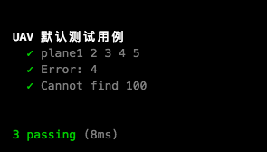

# UAV-thoughtworks
> 代码环境 `OS X 10.12.6` `node v9.0.0` `npm v5.5.1`

----

### 归纳条件

1. UAV首次进入监控区域  `{UAV ID} {X} {Y} {Z}` 不符合规则为故障.
  - `UAV ID` - 数字和字母组成唯一ID
  - `X, Y, Z` - 无人机位置,技术单位为整数
2. UAV在首次发送后持续发送的 `{UAV ID} {X'} {Y'} {Z'} {offsetX} {offsetY} {offsetZ}` 不符合规则为故障.
  - `{X'} {Y'} {Z'}` 前一次的地址
  - `{offsetX} {offsetY} {offsetZ}` 偏移量
3. UAV一旦判断故障后所有信息判成故障 `(NA, NA, NA)`.
4. 输入 每个文本仅记录一架飞机的记录和序号.
5. 输出 不存在, 存在, 故障.

-----

### 程序思路

> `Monitor` 首先对文本数据处理, 然后根据上下关系对数据加工, 然后通过get方法获取结果

-----

### 方法使用
```js
  const Monitor = require('./uav.js')
  new Monitor(`记录数据`).get(`虚幻`)
```

### 单元测试
> mocha + chai

> 执行 `npm run test` 查看结果 

